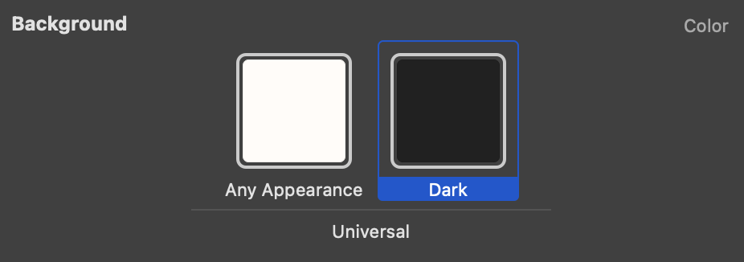
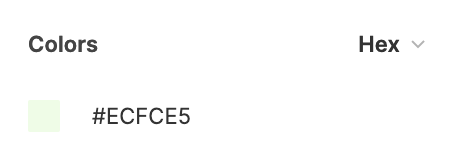
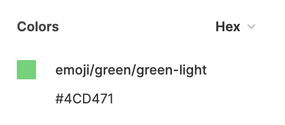
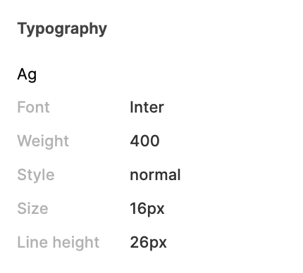
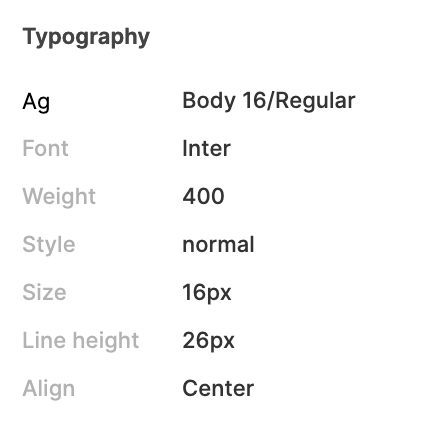

# Open Collaboration

## Mobile Designer x Mobile Developer

### Colors

* Create a Figma page with `ALL` the colors
  * This allows the developer to setup the colors all at once
* Each color must have a `Dark Mode` counterpart `beside` them
  * This allows the developer to use built-in dark/light color handling
    * In this example, `Background` color name will display appropriate color depending on user’s UI settings.
    * `Background` will display `Light Gray` in light mode, and `Dark Gray` in dark mode

* Disregard this if color is identical in both light and dark modes
* Use `Color` components in `everything`

From this

To this, to enable flexible adjustments to colors later on.

*   It's also recommended to use `Semantics Names` rather than `Color Names` as colors may change later on, and dark mode often uses contrasting colors. (e.g. `Background` is white on light mode, then black in dark mode)

    | SEMANTIC (Recommended) | COLOR (Discouraged) |
    | ---------------------- | ------------------- |
    | Success                | Green               |
    | Background             | White               |
    | Primary                | Blue                |
    | Secondary              | Gray                |

### Icons

* Create a Figma page with `ALL` the icons
  * This allows the developer to
    * Setup icons all at once
    * `Export` the icon in `any format they require`
* For `single colored icons`, they should be in `pure black` #000000
  * This allows the developer to tint the icon on the fly using code, rather than saving every color variation of the icons (decreasing asset size)
* For `multi-colored icons`, they can be used as is

### Scaling

* `PX (pixels) = PT (points) = DP (density-independent pixels)`

### Text

* Create a Figma page with `ALL` the text variations (size, weight, color, etc.)
  * This allows the developer to setup text variations all at once
* Use `Text` components in everything

From this

To this

* This prevents inconsistencies with the design components
* And enables flexibility for adjustments on both design and developer side
* Line Height
  * In iOS, there is no way to set this, so our workaround will be
    * `Line Height` equals `Font Size`
    * `Paragraph Spacing` is used instead to specify spacing between lines of text

### UI

* If you use various UI elements with `similar functions`, please write a note on when one is used over the other
  * e.g. Using `<` , `x` , and `Back` on the same app
    * please write on the Figma file why certain variations are preferred over certain screens
    * this allows both designers and developers
      * to have a single source of truth
      * create consistency across the design and code components
      * avoid misusing one over the other

### Store

**App Icon**

* iOS
  * **Format**: PNG
  * **Color Space**: Display P3 (wide-gamut color), sRGB (color), or Gray Gamma 2.2 (grayscale)
  * **Layers**: Flattened with no transparency
  * **Shape**: Square with no rounded corners
  * **Resolution**: `1024 x 1024 px`
* Android
  * **Extension**: Your app icon must be a transparent PNG or JPEG
  * **File size**: up to 1 MB,
  * **Resolution**: `512 px by 512 px`

**App Screenshots**

* iOS
  * [https://help.apple.com/app-store-connect/#/devd274dd925](https://help.apple.com/app-store-connect/#/devd274dd925)
    * Only provide those marked with `Required if app runs on iPhone`
* Android
  * Upload 2-8 phone screenshots.
  * **Extension:** Screenshots must be PNG or JPEG
  * **File size**: Up to 8 MB each
  * **Resolution**: `16:9 or 9:16` aspect ratio, with each side between `320 px and 3,840 px`

**Feature Graphic or Header**

* Android
  * **Extension:** Your feature graphic must be a PNG or JPEG,
  * **File size**: up to 1MB
  * **Resolution**:`1,024 px by 500 px`
